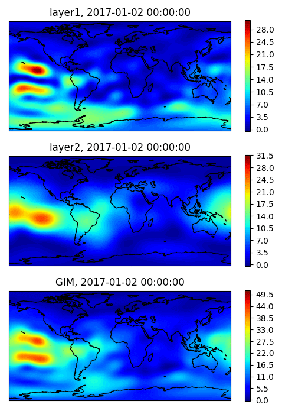

# MosGIM2

Global Ionopsheric Mapping with GNSS. 

## About

This code implements an original method for constructing Global Ionospheric Maps (GIM) of Total Electron Content (TEC) based on the analysis of solely phase measurements of GNSS signals at a pair of coherent frequencies, which does not require satellite/receiver DCBs estimations and thus makes it easier to combine different GNSS systems within single reconstruction algorithm.
This  method uses the representation of the ionosphere as one or two thin layers with the electron content in each of them given by a truncated expansion into a series of spherical harmonics in Sun-fixed coordinate system. The expansion coefficients are determined by least squares with inequality constrains representing the positivity of TEC, implemented by solving the corresponding linear complementarity problem (LCP). Algorithm description for single thin layer model is given in (cite if using code for your research): 

    Padokhin, A. M., E. S. Andreeva, M. O. Nazarenko, and S. A. Kalashnikova. "Phase-Difference Approach for GNSS Global Ionospheric Total Electron Content Mapping." Radiophysics and Quantum Electronics, 65(7): 481-495, 2023
    
Find full text paper [here](https://www.researchgate.net/profile/Artem-Padokhin/publication/370183741_Phase-Difference_Approach_for_GNSS_Global_Ionospheric_Total_Electron_Content_Mapping/links/64437a00d749e4340e2cb413/Phase-Difference-Approach-for-GNSS-Global-Ionospheric-Total-Electron-Content-Mapping.pdf)

## Prerequirements 

Code and launch were tested for Linux (Mint) and `python3.6.9`
Code uses `numpy`, `scipy`, `matplotlib`, `cartopy`, `h5py`, `lemkelcp` and `pyIGRF` packages.
If you get TypeError: 'range' object does not support item assignment when calling `process.py`, adjust lines 8&9 `lemkelcp.py` in python dist-packages accordingly:

    self.wPos = list(range(n))
    self.zPos = list(range(n,2*n)) 

## Use test data

Test data is the output data (in TXT format) from the [`tec-suite`](https://github.com/gnss-lab/tec-suite) package developed by [`SIMuRG`](https://simurg.space/) team. To use with `MosGIM2` you need to change default output of `tec-suite` in its configuration file `tecs.cfg` as following:

    recFields = 'datetime, sat.x, sat.y, sat.z, tec.l1l2'

You can download test dataset obtained with `tec-suite` for approximately 300 IGS stations and suitable to use with MosGIM2 via this [link](http://atm007-3.phys.msu.ru/gggimm/2017-002.zip) 

## Run processing

Set necessary parameters in `config.py`. Unzip test dataset to `data_path` directory, and adjust `res_path` to the directory where you wish to store results in HDF5 format. All other parameters are explained in comments and could be left as provided for running test example.

If you want to work in modip coordinates, you need to generate file `modip.npz` with the grid of modip latitudes. Use `modip.py` script for it, arguments are year and altitude in kilometeres. Such file for year=2017 and alt=300km is provided within repo. 

    python modip.py --year 2017 --alt  300.

Use `process.py` to solve for coefficients of spherical harmonics expansion of GIM in MLT coordinate system, which will be stored in `res_file`

    python process.py

Script `plot.py` is provided for your convinience to give an example of converting SH coefficients from `res_file`, obtained at the previous step, to plot GIMs in spherical coordinate system. 

    python plot.py --in_file res_file --out_file somefile.gif 
